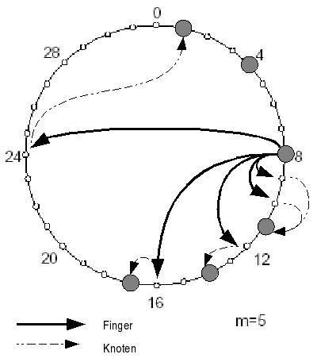

# Chord

Chord is a protocol and algorithm for a peer-to-peer distributed hash table.

## Short version

1. Schritt
```
Node0 (SUCC=Node0, Pre=Node0)
```
Node0 setzt sich als selbst PRE und SUCC.

2. Schritt
Neue Node1 frägt bei Node0 nach seinem Successor (find_successor()).
Da wartet er auf die Antwort, Node0 gibt sich selbst als Successor zurück.
State:
```
Node0 (SUCC=Node0, Pre=Node0)
Node1 (SUCC=Node0, Pre=Null)
```

3. Schritt
Node1 frägt seinen Successor (Node0) nach dessen Predecessor und wartet auf Antwort.
State:
```
Node0 (SUCC=Node0, Pre=Node0)
Node1 (SUCC=Node0, Pre=Node0)
```
4. Schritt
Node1 beantwortet seinem Successor und Predecessor, dass er dessen neuer Pre-/Successor ist.
State:
```
Node0 (SUCC=Node1, Pre=Node1)
Node1 (SUCC=Node0, Pre=Node0)
```
Chord Ring ist initialisiert!

## Topology

- Nodes and keys are assigned an `m`-bit identifier (ID).
- Therefore at most a number of `2^m` nodes are allowed in the system.
- A base hashing function will calculate this identifier (ID), e.g. SHA-1 (`m=160`) by applying it on the IPAddr of the node or the keys themselves
- The nodes are arranged in an identifier circle `2^m` (_Chord Circle_)
- A key `k` gets assigned to node `n` whose identifier (ID) is **greater or equal** (>=) to the identifier (ID) of the key `k`
- This node is called the successor node of `k`
- Chord only provides one function: Find for a given key `k` the corresponding node `n`. Chord doesn't provide functionality actually to secure data on the on the responsible nodes.

## Basic query

- Linear search provides a simple technique to query a node within the _Chord Circle_.
- Every node `n` only knows its successors `n' (Successor)`. No more information is needed.

```rust
n.find_successor(id)
  if ( id ∈ (n, successor] )
    return successor;
  else
    return successor.find_successor(id);
```

- If a query gets relayed to a node, this node verifies if its successor has the queried key. If so, the search is finished.
- Otherwise, the query gets passed on to the succeeding nodes until its target is reached.
- This query is inefficient because the length of the search path is linear to the number of nodes in the system.
- Linear search provides a fallback variant.
- Therefore the minimal requirement of linear search would be that every node knows its successor.
- Consequently, linear search constitutes the minimum requirement of the correctness of the _Chord protocol_.

## Scalable query

- To provide a more efficient search more information about the _Chord Circle_ is needed.
- Every node gets a table with references to `m` further nodes, whereby `m` constitutes the number of bits of the used identifiers (IDs).
- The references are called `Finger`. The table is called `Fingertable`.

## Fingertable

- The first entry of the table is actually the node's immediate successor (therefore an extra successor field is not needed).
- The start value of the `i`-th table's entry of node `n` is occupied by `n + 2^(i-1)`. The node-value of this entry points to the first node which follows node `n` with a distance of a least `2^(i-1)`.

```rust
n.find_successor(id)
  n' = find_predecessor(id);
  return n'.successor;

n.find_predecessor(id)
  n' = n;
  while (id ∉ (n', n'.successor])
    n' = n'.closest_preceding_finger(id);
  return n';  

/* This is a non-transparent approach. 
   A transparent version would instead forward the query to the finger-node
   than access the finger-node directly. */

n.closest_preceding_finger(id)
  for i = m downto 1
    if (finger[i].Knoten ∈ (n, id))
      return finger[i].Knoten;
  return n;
```

- If node `n` gets a search query after key ID `k` it looks for
  - closest, known predecessor of `k` in its fingertable
  - by scanning the fingertable vom **bottom to top**
  - until the first entry `i` is found whose node is **not** located between node `n` and key ID `k`
  - therefore finger entry `i+1` constitutes the closest predecessor of the `k` which node `n` is aware of
- The search continues with the help of the in the `i+1` finger entry`s referenced node.
- The search continues until the node is found whose `successor` is responsible for `k`.

### Fingertable example

- Node `8` gets a search query after key ID `3`.
- Therefore this node searches at first for its closest, known predecessor of `3`, which is node `1` and forwards the search query to this node.
- Node `1` determines that its successor (node `4`) is responsible for this key with ID `3` and finally ends the search.



Structure of fingertable of node `n=8`

| # 	| start (n + 2^(k-1)) 	| node 	|
|---	|---------------------	|------	|
| 1 	| 9                   	| 11   	|
| 2 	| 10                  	| 11   	|
| 3 	| 12                  	| 14   	|
| 4 	| 16                  	| 17   	|
| 5 	| 24                  	| 1    	|

```rust
finger[k].Start = (n+2k – 1) mod 2m;  (1 ≤ k ≤ m)
finger[k].Knoten = erster Knoten ≥ finger[k].Start;
successor = finger[1].Knoten;
```

## Stabilization

- To ensure correct lookups all successor pointers must be up to date.
- Therefore, a stabilisation protocol is running periodically in the background which updates finger tables and successor pointers.

```rust
n.stabilize()
  x = successor.predecessor;
  if( x ∈ (n, successor) )
    successor = x;
  successor.notify(n);

n.notify(n')
  if ( predecessor is nil or n' ∈ (predecessor, n) ) 
    predecessor = n';

n.fix_fingers()
  for i = 1 to m 
    finger[i].Knoten = find_successor(finger[i].Start);
```

- `stabilize()`: `n` asks its successor for its predecessor `p` and decides whether `p` should be `n‘`s successor instead (this is the case if `p` recently joined the system).
- `notify()`: notifies `n`‘s successor of its existence so that it can change its predecessor to `n`
- `fix_fingers()`: updates finger tables

## Node join

- Whenever a new node joins, three invariants should be maintained (the first two ensure correctness and the last one keeps querying fast)
  - Each node's successor points to its immediate successor correctly.
  - Each key is stored in `successor(k)`.
  - Each node's finger table should be correct.

- To satisfy these invariants a `predecessor` field is maintained for each node.
- The following tasks should be done for a newly joined node `n`:
  - Initialise node `n` (the predecessor and the finger table).
  - Notify other nodes to update their predecessors and finger tables.
  - The new node takes over its responsible keys from its successor.

```rust
n.join(n')
  predecessor = nil;
  successor = n'.find_successor(n);
```

- The predecessor of `n` can be easily obtained from the predecessor of `successor(n)` (in the previous circle).
- As for its finger table, there are various initialisation methods.
- The best method is to initialise the finger table from its immediate neighbours and make some updates, which is `O(log N)`.